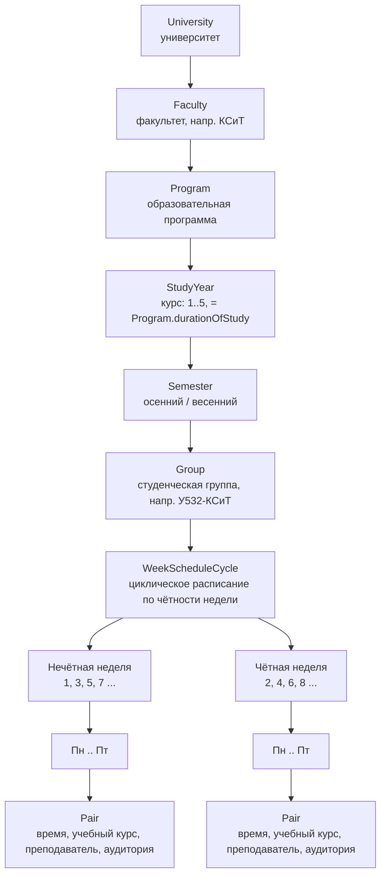
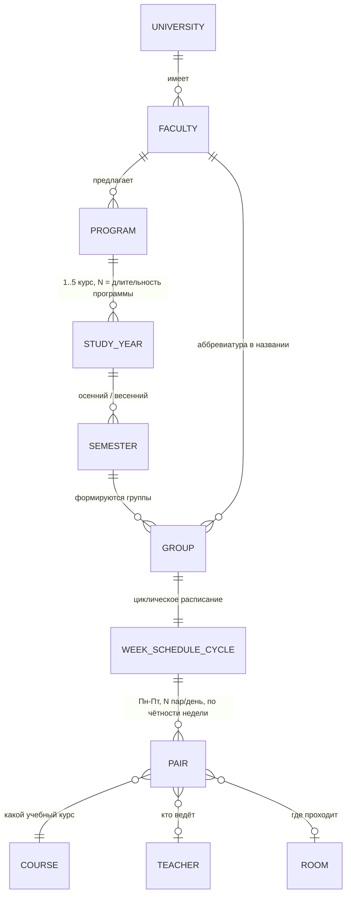
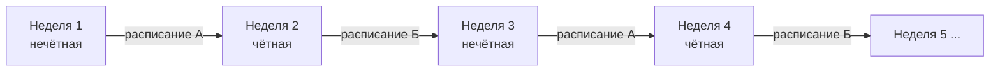

# TARGET.md — Целевая модель расписания занятий

> Не план внедрения (см. `ROADMAP.md`), а фиксация конечного видения: как должна выглядеть доменная
> модель расписания занятий, когда она будет реализована полностью. Этапы `ROADMAP.md` должны
> проектироваться с оглядкой на эту схему, чтобы не пришлось потом всё переделывать.

⚠️ **Пример расписания ниже — иллюстративный**, составленный по описанию из постановки задачи. Сама
постановка обрывалась на слове «Пример:» без содержимого — если у вас есть готовый конкретный пример
(таблица/скриншот реального расписания), пришлите его, и я скорректирую документ под него.

---

## Терминологическая развилка: «курс» ≠ `Course`

В домене слово «курс» используется в двух не связанных друг с другом смыслах, и это стоит держать в
голове при чтении остальной части документа:

| Термин | Что имеется в виду | Где живёт в модели |
|---|---|---|
| **Курс (год обучения)** | «студент 3-го курса» — просто номер года обучения, от 1 до 5 | Новая сущность `StudyYear`, см. ниже |
| **Курс (учебный предмет)** | «курс "Алгоритмы"» — уже существующая в коде сущность `Course` (issue #29) | `entity.Course`, привязана к `Department` и `Teacher` |

Дальше по документу «курс» без уточнения = **год обучения**. Учебный предмет всегда называется явно —
«учебный курс» или `Course`.

---

## Иерархия сущностей



**Что уже есть в коде на момент написания документа**, а что — целевое состояние:

| Сущность | Статус |
|---|---|
| `University`, `Faculty`, `Program`, `Department`, `Teacher`, `Student` | ✅ реализовано |
| `Course` (учебный предмет), `Lecture` (разовая лекция) | ✅ реализовано (Этап 2, issue #29/#30) |
| `StudyYear` (год обучения 1–5) | ❌ не реализовано — целевая сущность |
| `Semester` (осенний/весенний) | ❌ не реализовано — целевая сущность |
| `Group` (студенческая группа) | ❌ не реализовано — целевая сущность |
| `WeekScheduleCycle` / чётность недели | ❌ не реализовано — целевая сущность |
| `Pair` / `Room` (аудитория) | ❌ не реализовано — целевая сущность |

---

## Связи между сущностями (ER-вид)



---

## Группа: соглашение об именовании

Пример из постановки: **«У532 КСиТ»**.

```
<Префикс кампуса/уровня> <Курс><Номер группы в потоке> <Аббревиатура факультета>
        У                    5    32                       КСиТ
```

- Точная семантика префикса (`У`) и структура номера — зависят от университета, поэтому в модели это
  просто человекочитаемое `Group.name` (строка), а не разбираемый по частям код. Год обучения, к которому
  относится группа, и факультет — отдельные связи (`Group.studyYear`, через него `Faculty`), а не то, что
  нужно парсить из имени.
- Если у разных университетов в системе разные соглашения об именовании — `Group.name` всё равно остаётся
  свободной строкой; связи (`studyYear`, `program`) — источник истины, а не текст названия.

---

## Циклическое расписание: чётность недели

Расписание группы задаётся не на конкретную неделю, а на **два слота, которые чередуются**:

- **Нечётная неделя** (1, 3, 5, 7-я неделя семестра...) — расписание A
- **Чётная неделя** (2, 4, 6, 8-я неделя семестра...) — расписание Б



Номер недели семестра вычисляется от даты начала семестра (`Semester.startDate`), а не от календарной
недели года — иначе чётность «съедет» при переносе даты начала занятий.

---

## Иллюстративный пример

**Группа:** У532 КСиТ · **Курс:** 5 · **Семестр:** осенний 2026/2027

### Нечётная неделя

| День | Пара (время) | Учебный курс | Преподаватель | Аудитория |
|---|---|---|---|---|
| Понедельник | 1 (08:00–09:30) | Алгоритмы и структуры данных | Иванов И.И. | 305 |
| Понедельник | 2 (09:40–11:10) | Базы данных | Петров П.П. | 210 |
| Вторник | 1 (08:00–09:30) | Операционные системы | Сидоров С.С. | 118 |
| Среда | 3 (11:20–12:50) | Алгоритмы и структуры данных (практика) | Иванов И.И. | 305 |
| Четверг | — | *(нет занятий)* | — | — |
| Пятница | 2 (09:40–11:10) | Базы данных (лабораторная) | Петров П.П. | ЛК-2 |

### Чётная неделя

| День | Пара (время) | Учебный курс | Преподаватель | Аудитория |
|---|---|---|---|---|
| Понедельник | 1 (08:00–09:30) | Сети и телекоммуникации | Кузнецов К.К. | 401 |
| Вторник | 1 (08:00–09:30) | Операционные системы | Сидоров С.С. | 118 |
| Вторник | 2 (09:40–11:10) | Сети и телекоммуникации (практика) | Кузнецов К.К. | 401 |
| Среда | — | *(нет занятий)* | — | — |
| Четверг | 3 (11:20–12:50) | Базы данных | Петров П.П. | 210 |
| Пятница | 2 (09:40–11:10) | Базы данных (лабораторная) | Петров П.П. | ЛК-2 |

Сетка времён пар (08:00–09:30, 09:40–11:10, ...) — тоже конфигурируемая величина, а не хардкод: разные
университеты в системе могут иметь разное количество пар в день и разную длительность.

---

## Что это означает для будущих этапов `ROADMAP.md`

- `Lecture` (issue #30) стоит с самого начала проектировать так, чтобы конкретная лекция могла быть
  порождена из шаблона `Pair` циклического расписания на определённую дату, а не только создаваться
  вручную по одной — иначе миграция на `WeekScheduleCycle` потребует полного пересмотра `Lecture`.
- `Enrollment` зачисляет студента на `Course` (учебный предмет), но фактическая посещаемость
  (`LectureAttendance`) должна в итоге разрешаться через `Group`, а не только напрямую через `Student` —
  иначе не получится массово создавать лекции сразу для всей группы.
- `Group`, `Semester`, `StudyYear`, `WeekScheduleCycle`, `Room` в текущем `ROADMAP.md` не заведены как
  отдельные этапы — при планировании этапа после «Зачисление и посещаемость» их стоит внести отдельным
  этапом, опираясь на эту схему.
